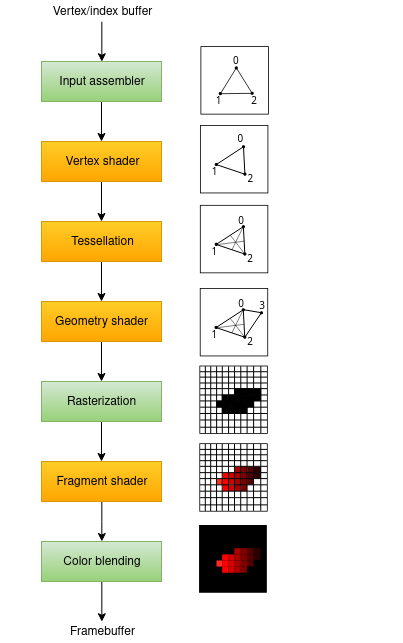
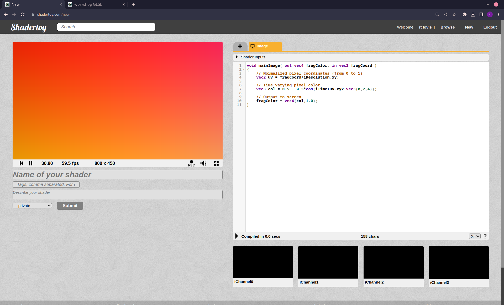
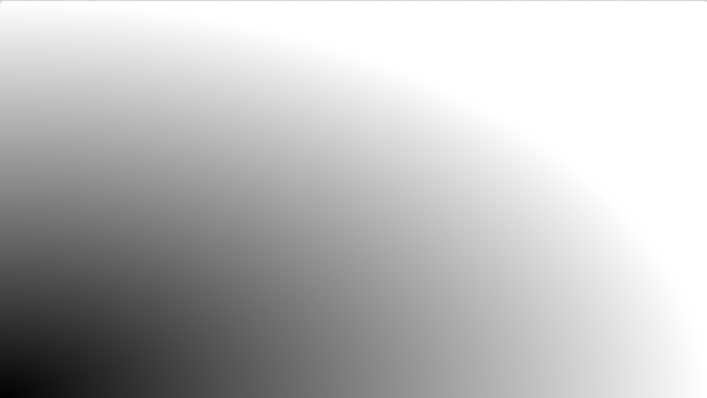
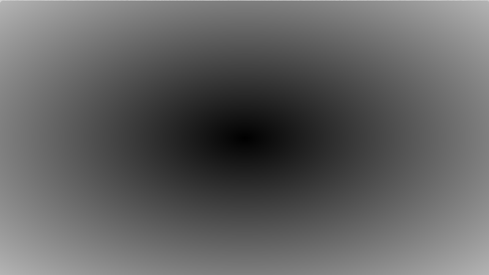
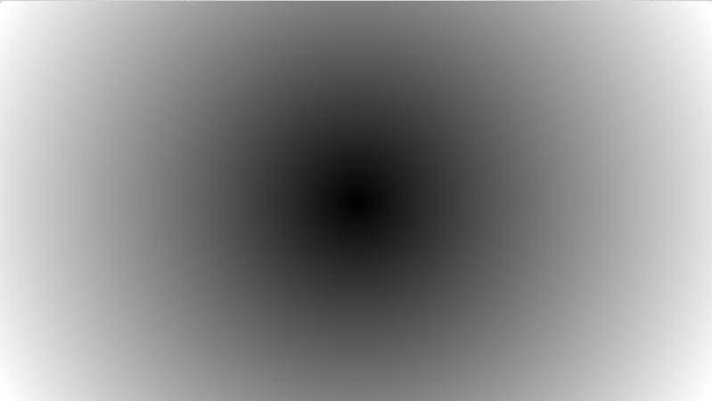
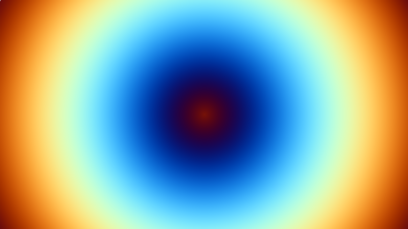
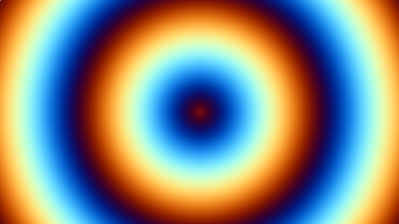
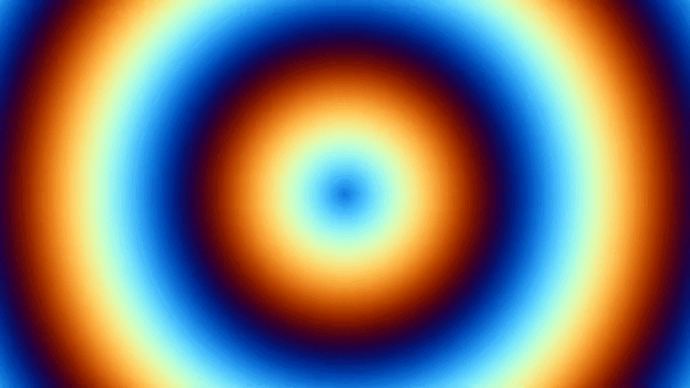
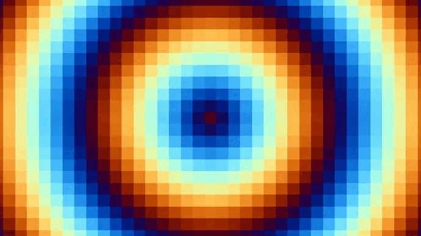
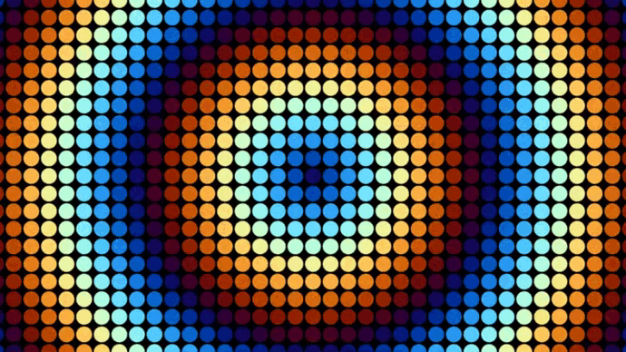

# GLSL
Bienvenue à cet atelier consacré à GLSL, le langage de shaders utilisé pour la programmation graphique. GLSL, abréviation de "OpenGL Shading Language," est un langage de programmation spécialisé qui permet de contrôler l'apparence visuelle des objets dans les applications graphiques en temps réel.

## Qu'est-ce que GLSL ?
GLSL est le langage de **shaders** utilisé dans le cadre de l'API graphique OpenGL, largement utilisée dans l'industrie du jeu vidéo, la simulation, la conception 3D, et bien d'autres domaines. Il permet de manipuler la manière dont la lumière interagit avec les objets, créant ainsi des effets de lumière, d'ombre, de texture et en fait tout ce qui s'affiche sur vos écrans.

## Qu'est ce qu'un shader ?
Comme je l'ai dit plus tôt GLSL sert à coder des shaders.

Un shader c'est **un bout de code qui va être exécuté par la carte graphique**.
La carte graphique va exécuter ce shader **à chaque frame pour chaque primitive**.

La nature de la **primitive** en question dépend du type de shader, elle peut être un **sommet** pour le vertex shader, un **triangle** pour le geometry shader, un **pixel** pour le fragment shader etc...

## Comment l'ordinateur affiche ?

Ce que je vous ai mis au-dessus ce sont la totalité des étapes par lesquelles passe l'ordinateur pour afficher un triangle à l'écran (cette liste peut changer en fonction des programmes).

La seule étape qu'on va retenir aujourd'hui c'est le **fragment shader**.
### Le Fragment shader
C'est le shader qui va manipuler les pixels.
La primitive du fragment shader est le pixel, **il va donc s'exécuter pour chaque pixel à l'écran pour chaque frame**.

## Commencer
Pour coder et tester nos programmes en temps réel on va utiliser [Shadertoy](https://www.shadertoy.com/)
qui est un site web d’édition et de visualisation de shader.

Après avoir crée un nouveau projet vous allez vous retrouver avec ça:


> [!warning]
> Je vous conseille de créer un compte pour sauvegarder votre travail, le navigateur peut crash.
> Aussi je déconseille **firefox** car il crash beaucoup plus souvent, utilisez **chrome**.

À la fin de ce workshop vous devriez obtenir ce résultat:
![[g1.gif]]
## Task 1
Shadertoy vous donne un code de départ quand vous créez un projet:
```c
void mainImage( out vec4 fragColor, in vec2 fragCoord )
{
    // Normalized pixel coordinates (from 0 to 1)
    vec2 uv = fragCoord/iResolution.xy;

    // Time varying pixel color
    vec3 col = 0.5 + 0.5*cos(iTime+uv.xyx+vec3(0,2,4));

    // Output to screen
    fragColor = vec4(col,1.0);
}
```

On va partir du début et garder seulement:
```c
void mainImage( out vec4 fragColor, in vec2 fragCoord )
{
    fragColor = vec4(1.0, 1.0, 1.0, 1.0);
}
```

> [!tip]
>Dans ce code `fragColor` est l'output du programme (la couleur du pixel) et on lui donne `vec4(1.0, 1.0, 1.0, 1.0)` qui représente donc le blanc en **rgba** (`vec4(0.0, 0.0, 0.0, 0.0)` pour le noir par exemple).

Avec ce code on va avoir un écran totalement blanc.

## Task 2
Maintenant ce qui serait sympa ça serait de récupérer les **coordonnés** du pixel sur lequel on agit.

Et en fait on les a déjà puisqu'elles sont dans la variable `fragCoord` qu'on vous donne en argument de la fonction `mainImage`.

Le problème c'est que ces coordonnés vont de **0 à 800 pour x** et de **0 à 450 pour y**. Et nous on veut qu'elles varient de **0.0 à 1.0** pour qu'on n'ait aucun problème avec la résolution de notre écran.

Il nous suffit donc de diviser nos coordonnés par la résolution de l'écran qui se trouve dans la **constante** `iResolution` et de stocker ces nouvelles coordonnés dans une **nouvelle variable** `vec2 uv`.

> [!warning]
> `iResolution` est un vec3 seul le **x** et le **y** nous intéressent.

> [!tip]
> GLSL est beaucoup centré autour des calculs de vecteurs donc il est facile de les manipuler.
>
> **Les opérations / \* + - entre vecteurs fonctionnent**
> ```c
> vec2 v1 = vec2(1.0, 2.0);
> vec2 v2 = vec2(3.0, 4.0);
> vec2 v3 = v1 / v2;
>  // ou vec2 v3 = vec2(v1.x / v2.x, v1.y / v2.y);
> ```
> **Extraire des vecteurs de vecteurs se fait aussi rapidement**
> ```c
> vec3 v1 = vec3(1.0, 2.0, 3.0);
> vec2 v2 = v1.xy;
> // ou vec2 v2 = vec2(v1.x, v2.y);
> ```

## Task 3
On va enfin pouvoir afficher quelque chose.

La fonction `length` donne la longueur d'un vecteur. Récupérez la longueur de `uv` dans la variable `d` et remplacez le **r**, **g** puis **b** du pixel par `d`.

> [!tip]
> `uv` étant les coordonnés de notre pixel c'est également le vecteur qui relie **l'origine au pixel**.

Vous devriez obtenir ce résultat:


Plus le pixel va être proche de l'origine plus il va s'assombrir.
Vous remarquerez que l'origine se trouve **en bas à gauche** de l'écran.

## Task 4
On va maintenant faire en sorte que le cercle parte du **milieux**.
Pour ça on va juste faire en sorte que le vecteur `uv` ne parte plus de l'origine mais du milieu de l'écran.

> [!tip]
> En prenant le point **A** et **B** on a le vecteur **AB**
> **AB = B - A**



On remarque que le cercle est étiré. C'est dû au fait que comme on a maintenant **x qui varie de 0.0 à 1.0** et **y qui varie de 0.0 à 1.0** alors on a dans le code **la même longueur en x et en y**.

Pour corriger ce problème, on va multiplier notre `uv.x` par le ratio de notre écran (`iResolution.x / iResolution.y`).



## Task 5
Maintenant on va ajouter de la couleur.
On va utiliser cette **fonction** pour ça:
```c
vec3 palette( float t ) {
    vec3 a = vec3(0.5, 0.5, 0.5);
    vec3 b = vec3(0.5, 0.5, 0.5);
    vec3 c = vec3(1.0, 1.0, 1.0);
    vec3 d = vec3(0.263,0.416,0.557);

    return a + b*cos( 6.28318*(c*t+d) );
}
```
Cette fonction va créer une **palette** à partir des couleurs **a**, **b**, **c** et **d** et va return une couleur dans cette palette à partir d'un float.

On va appeler `palette` en lui donnant `d` en argument et récupérer cette couleur dans une variable `vec3 color`.

Enfin on aura:
```c
fragColor = vec4(color, 1.0);
```


Si vous voulez changer les couleurs vous pouvez changer **a**, **b**, **c** et **d** de la fonction `palette`.
Ce site aide à créer de nouvelles palettes: [Palettes](http://dev.thi.ng/gradients/)

Toutes nos manipulations avec `uv` tout à l'heure peuvent être faites en une ligne:
```c
vec2 uv = (fragCoord * 2.0 - iResolution.xy) / iResolution.y;
```
Ici j'en profite aussi pour dé-zoomer un peu la fenêtre.



## Task 6
On ajoute du mouvement.

Pour ajouter du mouvement on va utiliser la constante `iTime` qui contient la durée de la simulation. 

En ajoutant simplement `iTime` à `d` on aura des changements de couleurs.


Ici je divise aussi `iTime` par deux pour ralentir le mouvement.

## Task 7
Pour ajouter l'effet **pixelisé** on va simplement **arrondir les coordonnés** de notre pixel.

On va utiliser cette **fonction** pour arrondir les coordonnés:
```c
float roundToDecimal(float value, float multiplier) {
    return round(value * multiplier) / multiplier;
}
```

On va arrondir `uv.x` et `uv.y` en donnant le multiplier `10.0`.



Et voilà en une vingtaine de lignes on a un résultat sympa qui aurait été vraiment long à faire en sfml.

## Bonus
Si vous voulez aller plus loin vous pouvez essayer d'obtenir ce résultat:



> [!tip]
> Utilisez la fonction GLSL `step`

Je vous invite à regarder les créations des aliens qui upload sur [Shadertoy](https://www.shadertoy.com/results?query=&sort=popular&filter=).

[Réponses](https://www.shadertoy.com/view/ddcfzs)
